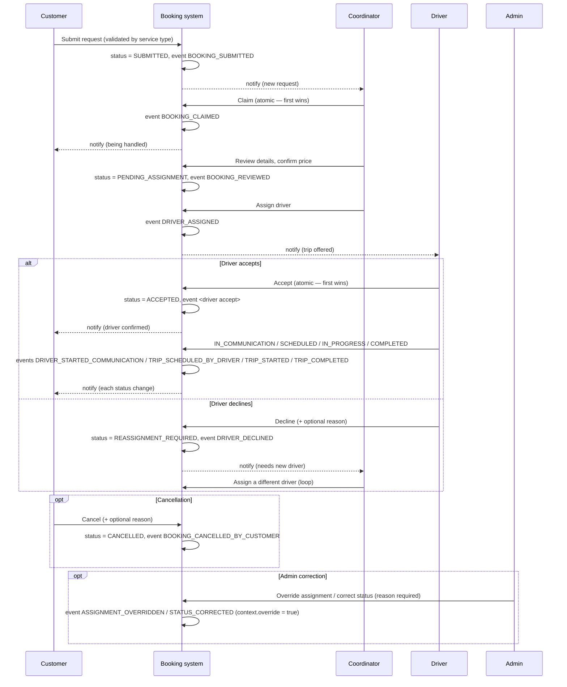

# PR2 — Production-ready role-based booking lifecycle and verification

Branch: `pr2/booking-lifecycle-verification`, off `main`. Written to be
pasted into the PR description.

## Why this PR exists

Reviewing `main` against the goal — "make one booking reliably move
through the complete lifecycle" — found that the public booking form
(`BookingForm.tsx`) and its API route (`/api/booking-enquiries`) were on
an older, email-only path: they sent an operator email and never wrote to
the database at all. Every downstream piece (coordinator queue, driver
offers, audit trail) already existed and worked correctly, but nothing
could reach them from the public entry point. Reconnecting that is the
foundation this PR is built on, alongside the specific integrity and
verification work requested.

`BookingEvent.eventType` → `event_type` is unchanged and untouched by this
PR — every event write in the codebase already goes through it correctly.

## Workflow

## Changes

### Reconnected the public booking flow
- `src/app/api/booking-enquiries/route.ts` — persists via
  `submitBookingRequest` again (it had regressed to email-only). Adds
  server-side per-service-type validation via `superRefine` (a direct API
  call can't skip what the form's `required` attributes enforce): transfers
  need pickup + drop-off, day tours need a chosen tour, hourly hire needs a
  vehicle class.
- **Identity enforcement**: when a session exists, the account's own name
  and email are used for the booking — never what the form submitted. A
  signed-in customer can't attribute a request to a different email, and a
  signed-in staff member's session is never treated as a customer identity
  (`authedUserId` stays `null` for non-customer roles, so the booking still
  gets created for whatever email was entered, exactly like an anonymous
  visitor — it just isn't silently attached to the staff member's account).
- `src/components/bookings/BookingForm.tsx` — added the editable fields
  each service type actually needs (pickup/drop-off, a tour picker sourced
  from the real tour catalog, a vehicle-class picker) instead of only
  accepting them via URL query params; shows "Booking as {name}" for
  signed-in customers instead of editable name/email fields; the success
  screen now shows the booking's actual status, a "next action" line, and
  — for signed-in customers — a link to track the request in their
  dashboard.
- `src/lib/email/notify-operator.ts` — recreated on the existing
  environment-variable email adapter (`src/lib/email/adapter.ts`, which
  already fails closed in production without `RESEND_API_KEY`/`EMAIL_FROM`
  rather than pretending to send). Always best-effort: the database write
  happens first and independently, so a missing/broken email config never
  loses a request.

### Workflow integrity fixes
- **`claimBooking` race condition** — was check-then-update
  (`findUnique` → check `coordinatorId` → `update`), so two coordinators
  claiming at the same moment could both succeed. Rewritten as an atomic
  conditional `updateMany` (`WHERE coordinatorId IS NULL`), matching the
  pattern already used correctly for driver acceptance in
  `respondToAssignment`. See `tests/coordinator-claim-atomic.test.ts`.
- **Descriptive `eventType`** — `transitionBooking()` previously had no way
  to pass one, so every status transition fell back to a generic
  `"STATUS_CHANGED"`/`"STATUS_<newStatus>"`. Added an `eventType` parameter
  and threaded specific values through every call site:
  `BOOKING_REVIEWED`, `TRIP_SCHEDULED`, `DRIVER_DECLINED`,
  `TRIP_STARTED`, `TRIP_COMPLETED`, `BOOKING_CANCELLED_BY_CUSTOMER`,
  `ASSIGNMENT_OVERRIDDEN`, plus the manual `recordEvent` calls for
  `BOOKING_CLAIMED`, `DRIVER_ASSIGNED`, `ASSIGNMENT_REVOKED`,
  `BOOKING_MARKED_PRIORITY`/`BOOKING_UNMARKED_PRIORITY`.
- Driver decline → `REASSIGNMENT_REQUIRED` with the reason preserved on
  the assignment row was already correct; unchanged, now with a
  descriptive event type and covered explicitly by
  `tests/reassignment-and-cancellation.test.ts`.
- **"Driver cannot alter an unassigned booking"** was already enforced by
  every driver action's own ownership-filtered query — this PR adds the
  explicit tests that were missing to prove it
  (`tests/driver-unassigned-guard.test.ts`): no assignment at all, an
  `OFFERED`-but-not-`ACCEPTED` assignment, and an assignment that exists
  but belongs to a *different* booking are all rejected.
- **Admin override requires a reason** was already enforced by
  `overrideAssignmentSchema`/`correctBookingStatusSchema` — added the
  missing explicit test for `overrideAssignment` (only
  `correctBookingStatus` had one before).

### What was already correct (verified, not changed)
- Driver acceptance is atomic (conditional `updateMany` on the parent
  booking's status is the real lock) — already covered by
  `tests/driver-atomic-accept.test.ts`.
- IDOR protections for customer bookings and driver assignments — already
  covered by `tests/customer-idor.test.ts`, `tests/driver-idor.test.ts`.
- Messaging gated on driver acceptance — already covered by
  `tests/messaging-availability.test.ts`.
- In-app notifications already fire for submission, assignment, driver
  accept/decline, status changes, cancellation, and new messages. This PR
  adds the one gap found: **claim** now notifies the customer
  ("{coordinator} is now looking after your booking") the first time a
  booking is claimed while still in `SUBMITTED`/`PENDING_ASSIGNMENT`.

## Testing

`npm test` — **60 passing tests across 18 files** (15 new this round):
- `tests/coordinator-claim-atomic.test.ts` — double-claim prevention,
  idempotent re-claim by the same coordinator.
- `tests/driver-unassigned-guard.test.ts` — four variations of "driver
  cannot alter/message a booking they aren't the accepted driver for."
- `tests/booking-enquiries-route.test.ts` — per-service-type validation
  (7 cases) and identity enforcement (signed-in customer, anonymous
  visitor, signed-in staff) at the actual route-handler level, not just
  the underlying `submitBookingRequest` function.
- Extended `tests/admin-overrides.test.ts` with the missing
  `overrideAssignment`-requires-reason coverage.

`e2e/full-workflow.spec.ts` — updated the happy-path spec to fill the
now-required pickup/drop-off fields (previously only settable via URL
query params, which the reconnected validation would now correctly
reject if missing) and to assert the new success-screen status text.
Added a second spec, `role-denial`, covering an unauthenticated visit to
`/admin` and a signed-in driver/customer being denied `/admin` and
`/coordinator`. **Neither was executed** — no browser binaries or live
database/server in this sandbox; see Verification below.

## Verification performed

- `npx tsc --noEmit` — clean except the pre-existing Prisma-client-stub
  cascade (this sandbox can't reach `binaries.prisma.sh` for
  `prisma generate`; every remaining line is "Module has no exported
  member X" for a Prisma enum/model, or an implicit-`any` that cascades
  from that — confirmed by diffing against a clean baseline).
- `npx eslint .` — clean (recreated `eslint.config.mjs`, which was missing
  from this snapshot despite the dependency being present in
  `package.json`).
- `npx vitest run` — 60/60 passing.
- `npx next build` (webpack/type-check phase run directly, since
  `npm run build`'s `prebuild` hook needs `prisma generate` and hits the
  same network wall) — verified twice: once for real, and once with
  Google Fonts stubbed purely to see further — webpack compiled
  successfully and stopped at exactly the same known Prisma-stub cascade,
  confirming nothing else broke.
- **Not run**: `prisma generate`/`prisma migrate` against a real database,
  Playwright E2E, or a full `npm run build`. All three need
  infrastructure this sandbox doesn't have — see below.

## Environment prerequisites for full verification

1. Network access to `binaries.prisma.sh` (or pre-cached Prisma engines) —
   run `npx prisma generate` and re-run `npx tsc --noEmit`; it should come
   back clean or with a small, specific diff, not the cascade seen here.
2. A real (disposable — e.g. a Neon branch) `DATABASE_URL`/
   `DIRECT_DATABASE_URL` — no migration is needed for this PR (no schema
   changes), but a real database is needed to run the app at all.
3. `npm run db:seed` for the demo accounts the E2E spec depends on
   (`admin@example.com`, `coordinator@example.com`, `driver@example.com`,
   `customer@example.com`, all `ChangeMe123!` — never seed this in
   production, and rotate immediately in any shared environment).
4. `npx playwright install --with-deps chromium`, then
   `E2E_BASE_URL=http://localhost:3000 npx playwright test`.

## Explicit non-actions (per instructions)

No migration in this PR (no schema changes — `event_type` and every other
column referenced were already present). Nothing merged, deployed, or
pushed; no Vercel environment variables touched; no production migration
applied. This branch is ready to push and open as a PR for review.
